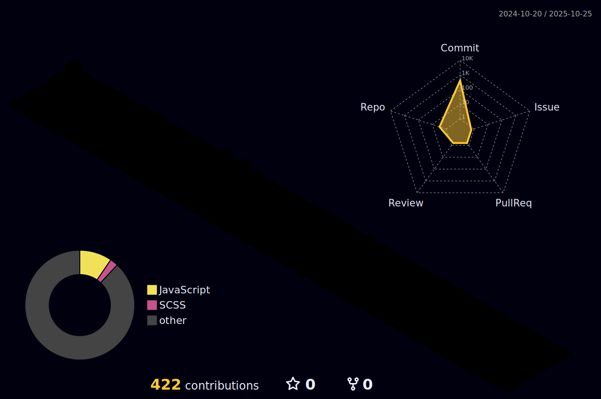

# changhyeon

  
  
  
  
  
  
  

<!--내용 부분-->
<h3 align="center">✨ Tech Stack ✨</h3>

  &nbsp&nbsp
  &nbsp&nbsp
  &nbsp&nbsp
  
  

  &nbsp&nbsp
  &nbsp&nbsp
    &nbsp&nbsp
  

   &nbsp&nbsp
  &nbsp&nbsp
  &nbsp&nbsp

 

  &nbsp

 

<h3 align="center">📚 Studying 📚</h3>

  &nbsp
  &nbsp
  &nbsp

 

 

<h3 align="center">🛠 Tools 🛠</h3>

  &nbsp
  &nbsp
  &nbsp

  &nbsp
  &nbsp

  &nbsp
  &nbsp

  &nbsp
  &nbsp  

 

<h3 align="center">📫 Contact 📫</h3>

<a href="https://velog.io/@kch5780">
    &nbsp
</a>

  

  

   

